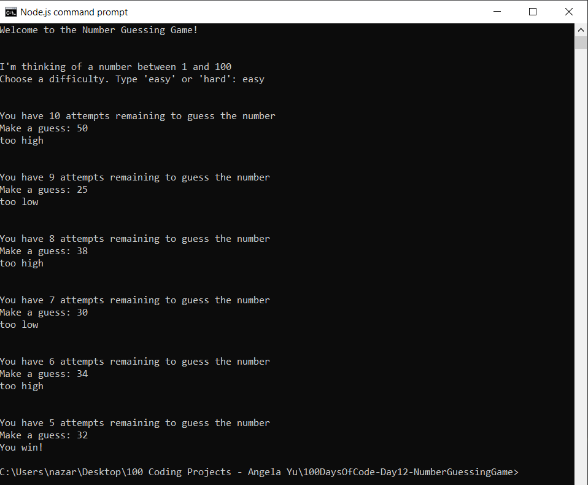

# 100 Days of Code - Day 12 - Number Guessing Game

# Prompt

Write a program that has the following console features:

* Write "Welcome to the Number Guessing Game!"
* Computer randomly chooses an integer between 1 and 100, inclusive.
* The user can decide if they want the easy or hard difficulty.
* if easy, the user gets 10 chances to guess the number
* if hard, the user gets 5 chances to guess the number
* Let the user know how many guesses they have remaining
* if the guess is greater than the target value, write "too high"
* if the guess is lower than the target value, write "too low"
* if the guess is equal to the target value, write "you win"
* if the user has no more guesses and did not find the target value, write "you lose"

# Example

Welcome to the Number Guessing Game!

I'm thinking of a number between 1 and 100.

Choose a difficult. Type 'easy' or 'hard': easy

You have 10 attempts remaining to guess the number.

Make a guess: 50

Too high

You have 9 attempts remaining to guess the number.

Make a guess: 25

Too high

You have 8 attempts remaining to guess the number

Make a guess: 10

Too low

You have 7 attempts remaining to guess the number

Make a guess: 15

Too high

You have 6 attempts remaining to guess the number

Make a guess: 12

You win

# Screenshot of Working Solution

